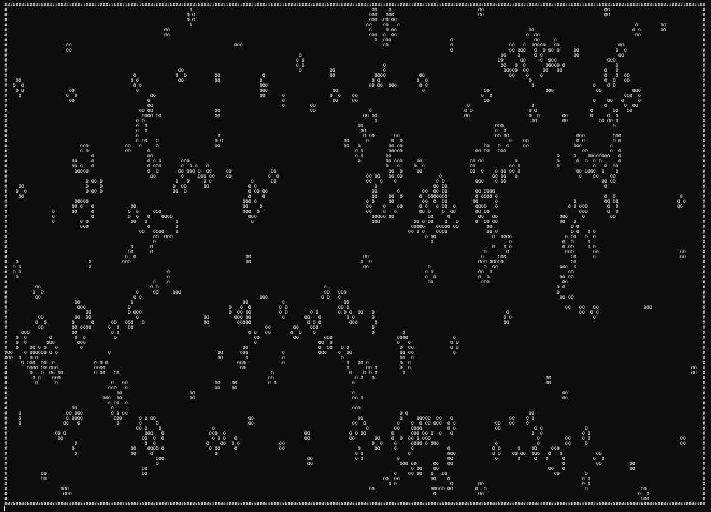
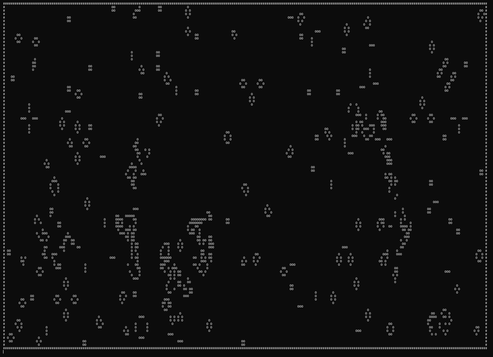

# Лабораторная работа №4 — Conway's Game of Life

## Задача
Реализовать симуляцию клеточного автомата «Игра Жизнь»: хранение двухмерного поля, применение правил эволюции, вывод анимации в терминал и управление скоростью обновления.

## Ключевые особенности реализации
- **Размер поля**: `width_x = 1250`, `height_y = 450`; по периметру автоматически создаётся стенка (`WALL`), предотвращающая выход волн за границы.
- **Структуры данных**: каждая клетка описывается `cell_entity` с типом (`DEAD`, `ALIVE`, `WALL`) и координатами; используется двойная буферизация (`main_board` и `buffer_board`), чтобы рассчёт следующего шага не искажал текущий кадр.
- **Инициализация**: случайное оживление ~2% клеток с дополнительным «кластерным» шумом, чтобы получить более интересные начальные паттерны.
- **Правила**: классические Conway B3/S23. Функции `check_cell_neighbors` и `change_cell_state` подсчитывают живых соседей и обновляют клетку в буфере.
- **Отрисовка**: ASCII-анимация в терминале (`#` — стенка, `O` — живая клетка, `space` — пусто). Курсор сбрасывается в начало окна, что создаёт эффект перерисовки «на месте».
- **Тайминг**: `sleep_ms(50)` ограничивает частоту кадров примерно до 20 FPS; при необходимости можно изменить задержку.

## Структура каталогов
- `src/board.c` — инициализация и хранение игрового поля.
- `src/cell.c` — вспомогательные операции над клеткой (оживить/убить).
- `src/rules.c` — реализация правил Game of Life и обновление буфера.
- `src/render.c` — вывод текущего состояния в терминал.
- `src/utils.c` — платформенно-зависимая задержка (`usleep`).
- `src/main.c` — точка входа: генерация стартовой конфигурации, главный цикл.
- `inc/*.h` — заголовки с типами и прототипами.
- `makefile` — сборка проекта и очистка артефактов.

## Сборка
Требуется компилятор GCC и POSIX-совместимый окружение (используется `usleep`).
```bash
make          # собирает ./game_of_life в корне lab04
```
Для пересборки с нуля используйте `make re`, для очистки — `make clean`.

## Запуск
```bash
./game_of_life
```
Программа заполняет поле и затем бесконечно применяет правила. Для завершения нажмите `Ctrl+C`.

## Настройка параметров
- Измените `width_x` / `height_y` в `inc/board.h`, чтобы подогнать размер под терминал.
- Скорость анимации контролируется значением в `sleep_ms` (файл `src/utils.c`).
- Начальную плотность можно поправить в цикле генерации в `src/main.c` (порог `noise`, вероятность `clustering`).

## Скриншоты
- 
- 

